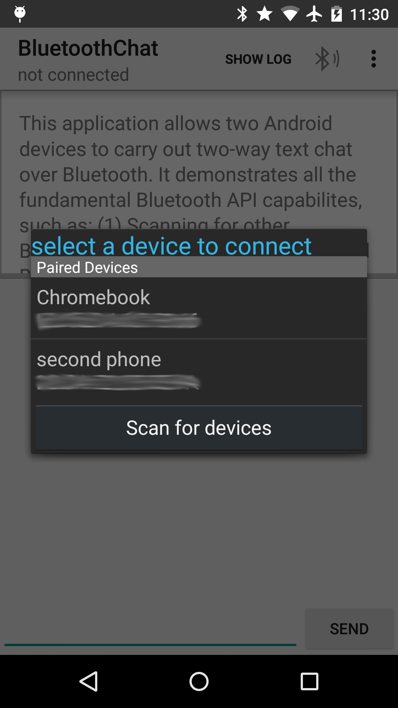
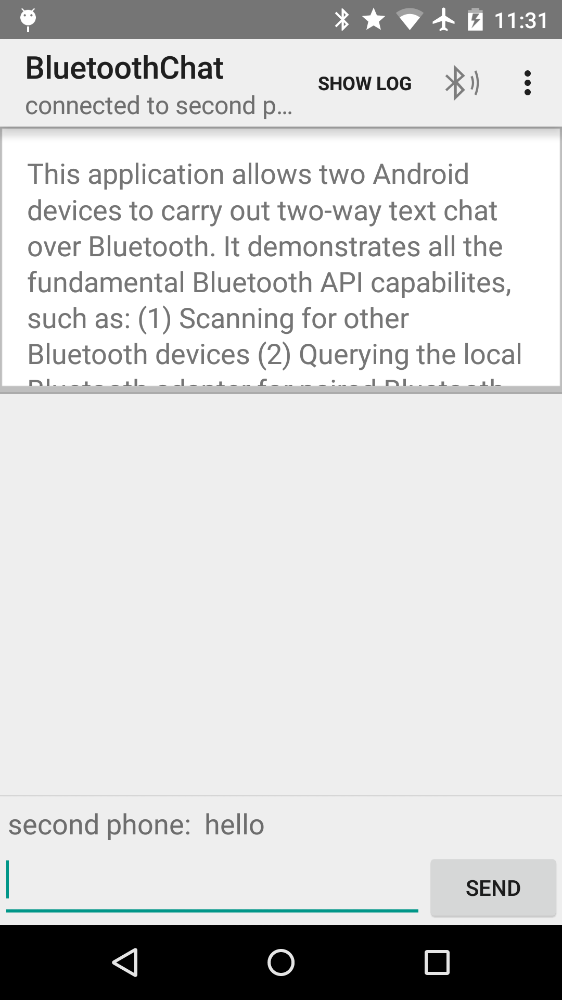

Android BluetoothChat
===================================

This sample shows how to implement two-way text chat over Bluetooth between two Android devices, using
all the fundamental Bluetooth API capabilities.

Introduction
------------

This sample should be run on two Android devices at the same time, to establish a two-way chat over
Bluetooth between the devices. Select "Made discoverable" in overflow menu on one device and click
on the Bluetooth icon on the other one, to find the device and establish the connection.

The sample demonstrates the following, using the [Bluetooth API][1]:

1. [Setting up][2] Bluetooth
2. [Scanning][3] for other Bluetooth devices
3. [Querying][4] the local Bluetooth adapter for paired Bluetooth devices
4. [Establishing RFCOMM][5] channels/sockets
5. [Connecting][6] to a remote device
6. [Transfering][7] data over Bluetooth

Pre-requisites
--------------

- Android SDK 27
- Android Build Tools v27.0.2
- Android Support Repository

Screenshots
-------------

   

Getting Started
---------------

This sample uses the Gradle build system. To build this project, use the
"gradlew build" command or use "Import Project" in Android Studio.

License
-------

Copyright 2017 Hritvik P
